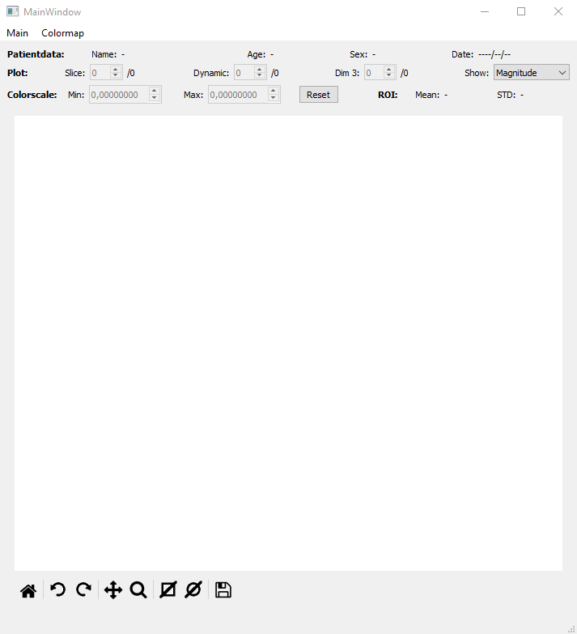
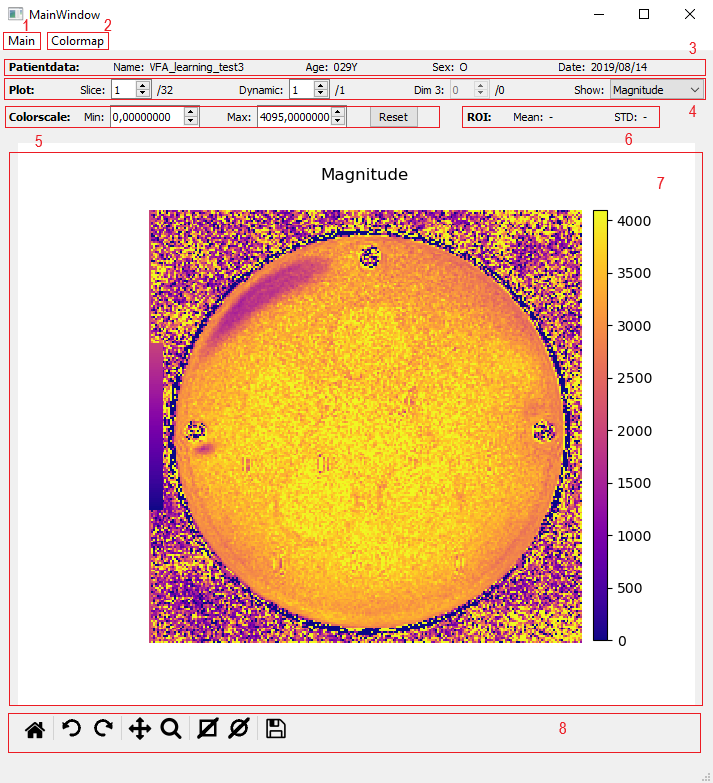
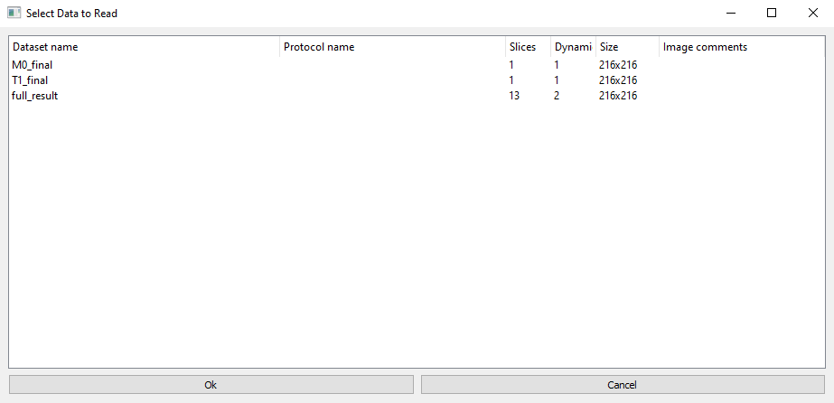

Usage description
=================

Installation and start
----------------------

To install the package, open a command or terminal window and cd into the root directory where ``setup.py`` is located,
then enter::

    python setup.py install

For this you need to have Python (3.6 or higher) installed. The required packages will be installed automatically.

To start the programme, enter::

    python run

How to use
----------

GUI
***

Once you have started the programme, a window opens which should look like this:

    ImageViewer after opening.

Once a file was loaded, the image data of the file will be displayed and a few GUI elements will change, as can be seen
in the following screenshot.

    GUI after file has been loaded.

The elements highlighted here are:

1 - Main menu
    Click here to load a file or show metadata of a loaded file.

2 - Colormap menu
    Click here to change the colormap used for the plot.

3 - Patientdata information
    Some of the loaded file's metadata is displayed here, if given.

4 - Plot actions
    The slice, the dynamic, a 3rd dimension (if given) of the loaded dataset can be selected here for
    display. A dropbox allows changing between magnitude and phase of the data.

    The slice and the dynamic can also be changed using the scroll wheel or the arrow keys: Up and down changes the
    slice, left and right changes the dynamic.

5 - Color scale settings
    Minimum and maximum of the color scale used for the plot can be changed here. When loading a file, the minimum and
    maximum of the color scale will be set to minimum and maximum of the loaded data (at the selected Dim 3). The reset
    button sets the limits back to those initial values.

    The colorscale can also be changed by pressing the scroll wheel and moving the mouse: Vertical movement changes the
    distance between the limits, making the interval smaller or bigger. Horizontal movement moves the whole interval up
    or down, leaving the width of the interval unchanged.

6 - ROI values
    If a region of interest (ROI) was selected using the toolbar functions, the mean and standard deviation of the data
    currently displayed within that ROI are displayed here.

7 - Image canvas
    The plot of the selected data, as well as the corresponding colorbar are shown here. The following key shortcuts
    can be used to control the plot:

    * The ``+`` and ``-`` keys allow zooming in and out.
    * ``ctrl`` + any of the arrow keys allow moving through the plot (this only works if only a part of the plot is
      visible at the moment, e.g. after zooming in).

8 - Toolbar
    This augmented maplotlib toolbar holds the following functions, which are explained further in `Toolbar actions`_:

    * *Home*: Reset the plot.
    * *Rotation (anti-)clockwise*: Clicking these two buttons rotates the plot by 90 degrees.
    * *Pan/Zoom*: Pan (move) or zoom the plot using these built-in matplotlib actions.
    * *ROI selection*: Select a region of interest in the shape of a rectangle or an ellipse inside the plot of which
      to calculate mean and standard deviation after pressing one of these buttons. Only one ROI can exist at a time.
    * *Save figure*: Built-in matplotlib function to save the plot.

Data formats
************

The ImageViewer supports h5 and dicom files. Image as well as meta data can be read in both cases.

For **dicom** files it is important that certain naming rules are being followed in order to correctly identify and
load different datasets and slices and dynamics of each dataset:

1. The first to -21 characters, which usually contain the scan name and the scan ID, are identical for each
   file belonging to the same set, and are unique among different sets.
2. Characters -16 to -13 contain the slice number.
3. The last 4 characters (-4 to -1) contain the dynamic number.

The negative numbers here correspond to counting "from the right" with -1 being the last character before the file
extension *.dcm*. A working example is

    Datasetname_ex00090004000500010002.DCM

*Datasetname_ex* defines the dataset, *0004* indicates that this is the fourth slice, *0002* indicates that this is the
second dynamic. All other characters and dimensions of the data are ignored (as of now), so 4 dimensions of image data
are supported.

For **h5** files it is assumed that the last two dimensions of the image data refer to x and y coordinates. If the data
has more than 2 dimensions, the first dimension is interpreted as the slice, the second as the dynamic. If there are
5 dimensions, the third dimension can also be selected in the GUI, but there is no specific name for it.

When selecting a dicom folder or .h5 file for loading which holds more than one dataset, another window will open,
which lets the user select a dataset:

    Window for selection of dataset.

In that window, Size means the size of one image in pixels, Protocol name and Image comments refer to metadata fields.

Metadata
********

Some of the metadata is shown directly in the main window after a file was loaded.

In the case of dicom files, this refers to the fields *PatientName*, *PatientAge*, *PatientSex*, and *AcquisitionDate*.
In case of h5 files, the ``attrs`` are searched for the keys

* *name, patient_name, patientname*
* *age, patient_age, patientage*
* *sex, patient_sex, patientsex*
* *date, acquisition_date, acquisitiondate*

where capitalisation is ignored, in order to retrieve that information.

For the dataset selection window, information is drawn from the fields *ProtocolName* and *ImageComments* in case of
dicom, while in the .h5 file's ``attrs`` the keys being looked for are

* *protocol, protocol_name, protocolname*
* *comment, comments, image_comment, image_comments, imagecomment, imagecomments*

where, again, capitalisation does not matter.

In order to see all metadata available, an own metadata window can be shown by clicking *Metadata* in the main
dropdown menu. The window has a search input field which lets you search for fields by name.

Toolbar actions
***************

The available toolbar functions have already been mentioned briefly in section `GUI`_ and shall be explained further in
the following paragraphs.

The **home** button resets the plot. Color scale limits, zooming and panning settings will return to initial values,
any ROI will be deleted. Rotation as well as slice and dynamic selections remain.

The **rotation** buttons allow rotating the image either clock- or anti-clockwise.

The **pan** and **zoom** actions are default matplotlib functionalities. *Pan* allows dragging the image moving the
mouse while pressing the left button, as well as zooming into or out of the point the cursor was at when the right
mouse button was clicked while holding the button and moving the mouse up/right or down/left. *Zoom* allows zooming in
to a rectangle drawn using the left mouse button, and out to a rectangle using the right mouse button.

For **ROI selection** there are two options: rectangle selection and ellipse selection. While keeping the left mouse
button pressed, a region of interest can be drawn on the plot. The mean value and standard deviation of all
datapoints within this ROI are calculated and displayed above the plot after the ROI was drawn. Once a ROI is
created, it can be resized and moved around the plot.

Last is the **save figure** action, which again provides default matplotlib functionality. It allows for saving the
current plot (including the colorbar).
